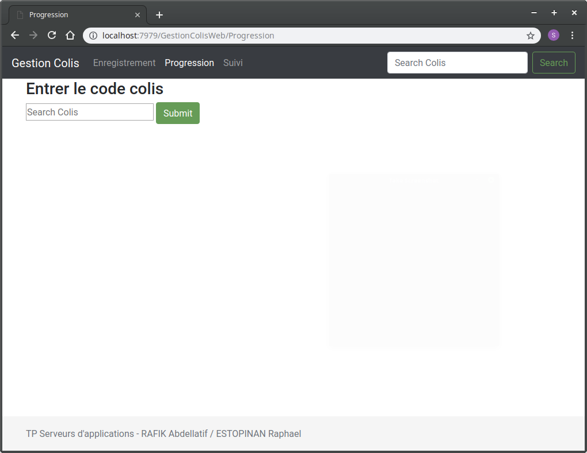

# I906 – TP1 Serveurs d'applications JavaEE

Travail réalisé par :
- Abdellatif RAFIK,
- Raphael ESTOPINAN,

Ce TP consiste à implanter une application j2ee pour gérer les « colis » et leur  acheminement via une interface web.

## Entity JPA
«Colis» caractérisé par :
- un identifiant unique,
- son poids,
- sa valeur,
- son origine,
- sa destination.

«acheminement» caractérisé par :
- latitude,
- longitude,
- emplacement (chaîne de caractères, par ex : entrepôt xxx, douane yyy, etc...),
- état (enregistrement, en attente, en acheminement, bloqué, livré,...).

Ces deux entity persistents ont une relation One-to-Many.
```java
@OneToMany(
          targetEntity = Acheminement.class,
          cascade = CascadeType.ALL,
          fetch = FetchType.EAGER,
          mappedBy = "colis",
          orphanRemoval = true)
  private List<Acheminement> acheminements = new ArrayList();
```
## EJB
Toutes les manipulations sur les objets persistants se font dans l'EJB "ColisOperationBean" en 
utilisant l'entity manager correspondant à l'unité de persistance des objets persistants 
manipulés.

```java
@Stateless
@Remote
public class ColisOperationBean implements ColisOperation {
	
	@PersistenceContext
	private EntityManager em;
```

## Utilisation de l'application
l'application possède trois servlets :
- Enregistrement : permet d'enregistrer un nouveau colis
- Progression : permet de faire progresser un colis déjà enregistrer
- Suivi : permet de suivre l'evolution d'un colis

1.

2.

3.



